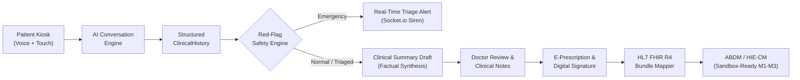

# MediKiosk Architecture & Clinical Data Flow

MediKiosk is an AI-assisted patient intake, clinical decision support, and longitudinal EHR interoperability platform designed for high-throughput hospital outpatient departments (OPD).

---

## End-to-End Clinical Data Flow

1. **Patient Kiosk (Multilingual Voice + Touch)**  
   Patients interact at the kiosk in English, Hindi, or Gujarati using browser speech recognition or responsive touch-screen options. Demographic registration auto-generates a unique MRN and OPD Token with digital informed consent.

2. **AI Conversation Engine**  
   The conversational agent conducts structured medical history-taking (HPI, past medical history, medications, allergies, review of systems). Extracted clinical facts are mapped dynamically without hallucinated diagnoses.

3. **Structured `ClinicalHistory` Extraction**  
   Every user utterance is mapped into categorical clinical slots stored in SQLite via Prisma ORM, producing an immutable record of patient-reported answers and confidence scores.

4. **Context-Aware `RedFlagEngine`**  
   Before any text is passed downstream, the rule engine screens for acute life threats (cardiac ischemia, stroke F.A.S.T., respiratory failure, active hemorrhage, hemodynamic vitals instability). It conservatively filters out negations (*"no chest pain"*), historical events (*"last year"*), and third-party references (*"my father"*).

5. **Real-Time Triage Alert / `ClinicalSummary`**  
   - If an emergency is triggered: A critical priority broadcast is dispatched via Socket.io to the Nursing / Triage Station (`/triage`) with audible alerts.
   - Concurrently, a structured clinical summary draft is synthesized for the attending physician.

6. **Doctor Review Command Center (`/doctor`)**  
   The attending physician reviews the AI summary alongside vitals entered by the nurse, uploaded document OCR extractions, and longitudinal timeline history. The doctor can edit or approve clinical notes and diagnoses.

7. **E-Prescription & Cryptographic Signature**  
   The physician prescribes medications (name, dosage, route, frequency, duration) and applies an electronic digital signature and timestamp.

8. **HL7 FHIR R4 Bundle Mapping**  
   The encounter, patient demographics, conditions, observations (vitals + labs), allergy intolerances, and medication requests are transformed into an official NRCES-compliant HL7 FHIR R4 Document Bundle.

9. **ABDM Sandbox-Ready Integration**  
   The FHIR bundle is prepared for Milestone 1 (ABHA verification), Milestone 2 (Consent Management), and Milestone 3 (Health Information Exchange / HIE-CM data push) to the National Health Authority (NHA) gateway.
